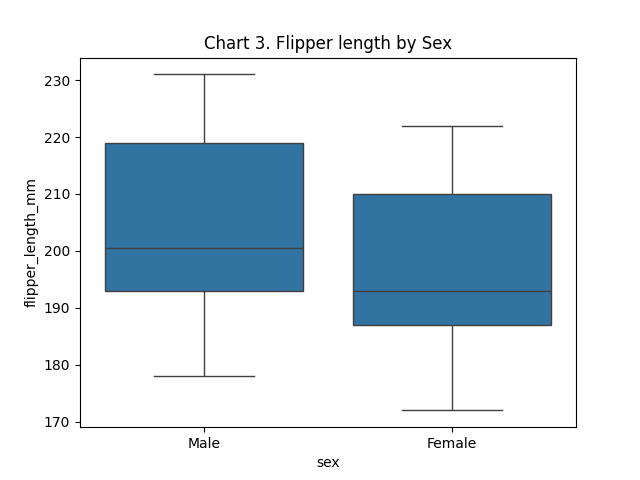
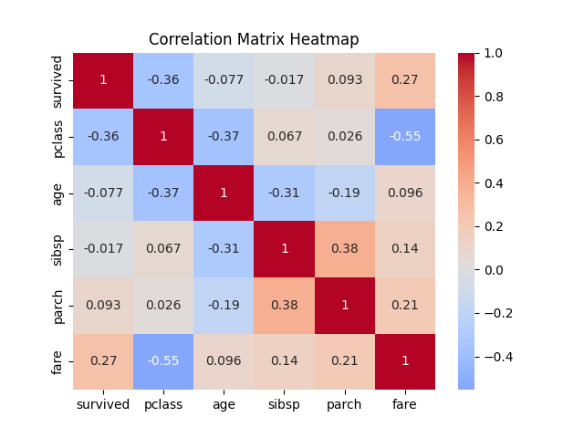
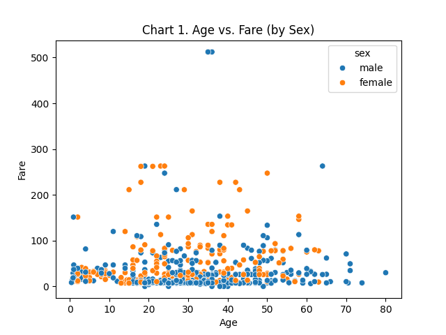
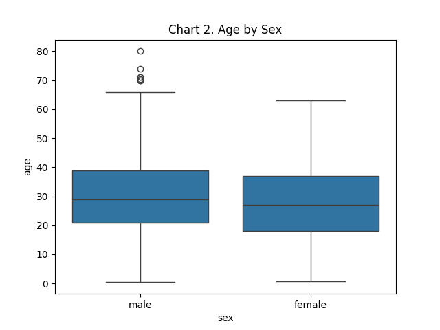
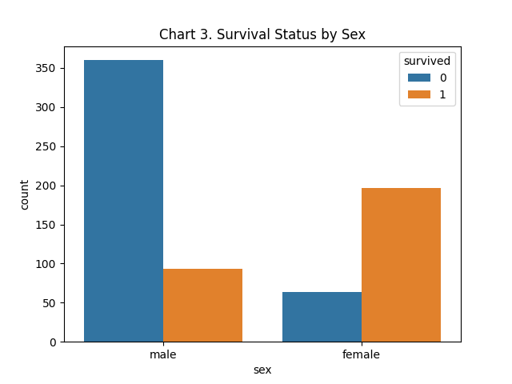
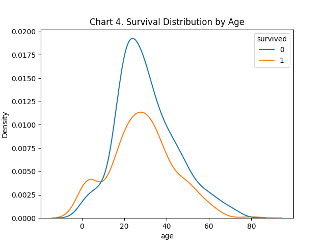

# datafun-04-notebooks

[](https://denisecase.github.io/pro-analytics-02/workflow-b-apply-example-project/)
[](./pyproject.toml)
[](./LICENSE)

> Professional Python project: exploratory data analysis with Jupyter notebooks.

Data analytics requires a variety of skills.
This course builds capabilities through working projects.

In the age of generative AI, durable skills are grounded in real work:
setting up a professional environment,
reading and running code,
understanding the logic,
and pushing work to a shared repository.
Each project follows the structure of professional Python projects.
We learn by doing.

## Command Reference

The commands below are used in the workflow guide above.
They are provided here for convenience.

Follow the guide for the **full instructions**.

<details>
<summary>Show command reference</summary>

### In a machine terminal (open in your `Repos` folder)

After you get a copy of this repo in your own GitHub account,
open a machine terminal in your `Repos` folder:

```shell
# Replace username with YOUR GitHub username.
git clone https://github.com/hasacco/datafun-04-notebooks

cd datafun-04-notebooks
code .
```

### In a VS Code terminal

These are listed for convenience.
For best results, follow the detailed instructions in
[pro-analytics-02 guide](https://denisecase.github.io/pro-analytics-02/).

```shell
uv self update
uv python pin 3.14
uv lock --upgrade
uv sync --extra dev --extra docs --upgrade

uvx pre-commit install

git add -A
uvx pre-commit run --all-files
# repeat if changes were made
uvx pre-commit run --all-files

# run the module to verify the environment (.venv)
uv run python -m datafun.app_case
uv run python -m datafun.app_hasacco
uv run python -m datafun.app_hasacco_titanic

# do chores
uv run ruff format .
uv run ruff check . --fix
uv run python -m pyright
uv run python -m pytest
uv run python -m zensical build

# save progress
git add -A
git commit -m "update"
git push -u origin main
```

</details>

## Notes

- Use the **UP ARROW** and **DOWN ARROW** in the terminal to scroll through past commands.
- Use `CTRL+f` to find (and replace) text within a file.
- You do not need to add to or modify `tests/`. They are provided for example only.
- Many files are silent helpers. Explore as you like, but nothing is required.
- You do NOT not to understand everything; understanding builds naturally over time.

## Troubleshooting >>>

If you see something like this in your terminal: `>>>` or `...`
You accidentally started Python interactive mode.
It happens.
Press `Ctrl+c` (both keys together) or `Ctrl+Z` then `Enter` on Windows.


## Technical Modification 6-8-26

A box plot of flipper length vs sex was added to notebook eda_hasacco.ipynb and app_hasacco.py.
Boxplot was saved in docs/ as Figure_4.png.
Also, findings and suggested next steps were added to Jupyter notebook.



## New Application - Titanic Dataset 6-8-26

New files: eda_hasacco_titanic.ipynb and app_hasacco_titanic.py

The penguins dataset was replaced by the Titanic dataset available in Seaborn.
The basic workflow of the notebook and .py file was kept the same, only updating required columns and variable names.
Different graphs/charts were used in this application, including a scatterplot, boxplot, clustered bar chart, and overlapping density plot.
Findings and suggested next steps were added as Markdown to Jupyter notebook and as comments to .py file.

## Example Output

```shell
2026-06-08 15:16:56 | INFO | EDA | --- Section 9: Summary and next steps ---
2026-06-08 15:16:56 | INFO | EDA | ========================
2026-06-08 15:16:56 | INFO | EDA | See .py file or notebook for summary of findings and suggested next steps.
2026-06-08 15:16:56 | INFO | EDA | ========================
2026-06-08 15:16:56 | INFO | EDA | -----  close the chart windows (with the close button) to continue  -----
2026-06-08 15:16:56 | INFO | EDA | ========================
2026-06-08 15:16:56 | INFO | EDA | EDA workflow complete
2026-06-08 15:16:56 | INFO | EDA | IMPORTANT: This script creates chart windows.
2026-06-08 15:16:56 | INFO | EDA | Close any chart windows and terminate this process with CTRL+c as needed.
2026-06-08 15:16:56 | INFO | EDA | ========================
2026-06-08 15:16:56 | INFO | EDA | Executed successfully!
2026-06-08 15:16:56 | INFO | EDA | ========================
```

## Findings and Visuals

Findings:
This dataset that is publicly available from Seaborn contains 891 rows and 15 columns. After cleaning the dataset based on required columns of sex, survival status, ticket class, age, number of siblings/spouses aboard, and number of parents/children aboard, there were 714 clean rows of data.
After EDA, the following was noted:
  - The average age of passengers was 29.7 years, with males tending to be slightly older than females (~2.8 years).
  - Females had a significantly higher average survival rate than that of males.
  - Females traveled with companions more than males.
  - In the 20 - 40 year age band, there appears to be significantly more deaths vs survivals when comparing to other age bands.

Suggested next steps:
  - Comparison of travel with companions to survival rates (Does this correlate to females' higher survival rates?)
  - Comparison of sexes in 20 - 40 year age band for survival rates (Do male vs female rates match that of entire data set?)
  - Analysis of travel with companions in 20 - 40 year age band (Does this match findings in first suggested next step?)










